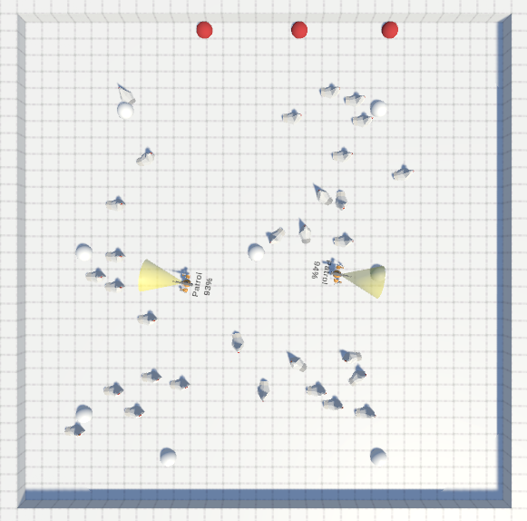

# UnityAgents
Modification of existing project about FSA AI agents made for university purposes.

Player has been removed. Now robots roam around the points (with breaks for charging) and collect food. After collecting enough of them the time score is saved and simulation is repeated. Main changes to original project include deletion of player, adjusted robots movement, editable amount of robots, food and percentage threshold that needs to be achieved.

